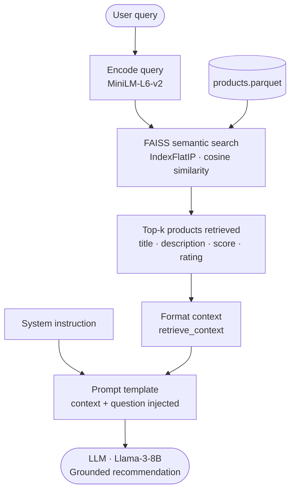

# DSCI_575_project_barafat2_moham136

## Dataset description

This project uses the **Amazon Reviews 2023** dataset hosted on Hugging Face: **`McAuley-Lab/Amazon-Reviews-2023`**.

We specifically pull the **All Beauty** subset using the following configurations:
- Reviews: `raw_review_All_Beauty`
- Product metadata: `raw_meta_All_Beauty`

The pipeline downloads both components and joins them to support a product-review search experience.

### What the data contains (high level)
- **Review data** includes fields such as review rating, review title, review text, and whether the purchase was verified.
- **Metadata** includes fields such as product title, average rating, price, description, store, and product details.

---

## Data processing

### Download + caching
Data is downloaded from Hugging Face via the `datasets` library. The pipeline:
1. Downloads the review and metadata splits (if not already present).
2. Saves them as parquet files locally.
3. Builds a merged parquet file used by downstream model-building scripts.

Key output files (created by `make data` / `src/download_data.py`):
- `data/processed/reviews.parquet`
- `data/processed/meta.parquet`
- `data/processed/merged.parquet`

### Fields used
When merging reviews with product metadata, we keep the following columns:

From **reviews**:
- `rating`
- `title` (review title)
- `text` (review body)
- `verified_purchase`

From **metadata**:
- `product_title` 
- `average_rating`
- `price`
- `description`
- `store`
- `details`

The join is performed on the product identifier:
- `parent_asin`

### Preprocessing for retrieval
Two retrieval approaches are supported, and each uses slightly different preprocessing.

**BM25 preprocessing (lexical retrieval)**
- Text is lowercased
- Punctuation is removed (non-alphanumeric replaced with whitespace)
- Tokenization is done by whitespace splitting
- English stopwords are removed (NLTK stopwords)
- A combined text field is built from:
  - review `title` + review `text` + `product_title`

Artifacts created by `src/build_bm25.py`:
- `data/processed/documents.parquet` (tabular documents used for displaying results)
- `data/processed/tokenized_corpus.pkl` (pre-tokenized corpus)
- `models/bm25_model.pkl` (serialized BM25 model)

**Semantic preprocessing (embedding retrieval)**
- A combined text field is built from:
  - `product_title` + review `text`
- Missing values are filled with empty strings
- SentenceTransformer embeddings are computed and stored on disk

Artifacts created by `src/build_semantic.py`:
- `data/processed/documents.pkl` (list of combined texts)
- `data/processed/embeddings.npy` (dense embeddings)
- `data/processed/faiss_index/index.faiss` (FAISS index)

---

## Retrieval workflows

The Shiny app supports multiple retrieval methods (selected in the UI):
- **BM25**
- **Semantic**
- **Hybrid** (available in the UI; combines signals from both approaches)

### BM25 workflow (lexical)
1. Load cached artifacts:
   - `data/processed/documents.parquet`
   - `models/bm25_model.pkl`
2. Preprocess the user query using the same tokenization rules as the corpus.
3. Score documents using BM25.
4. Return the top *k* results with a BM25 `score`.

In the app, BM25 results are returned with:
- `product_title`, `text` (truncated for display), `score`, `rating`

### Semantic workflow (dense retrieval)
1. Load the combined-text documents and the FAISS index.
2. Embed the user query using a SentenceTransformer model (`all-MiniLM-L6-v2`).
3. Retrieve nearest neighbors from FAISS (L2 distance on embeddings).
4. Return the top *k* results with a distance-based similarity signal.


## RAG Pipeline Workflow




---

## Run the app locally

### Option A (recommended): use the Makefile
From the repository root:

1. Clone the Repository
```bash
git clone git@github.com:UBC-MDS/DSCI_575_project_barafat2_moham136.git
```

Then navigate into the project folder

2. Create and activate the conda environment:
   ```bash
   conda env create -f environment.yml
   conda activate dsci-575-project
   ```

3. Ensure `make` is available:
   ```bash
   conda install -c conda-forge make
   ```

4. Build everything and launch the app:
   ```bash
   make all
   ```

This runs:
- `python src/download_data.py`
- `python src/build_bm25.py`
- `python src/build_semantic.py`
- `shiny run app/app.py`

After the first full build, you can run only the app:
```bash
make app
```

### Option B: run steps manually (no Makefile)
From the repository root (with your environment activated):

```bash
python src/download_data.py
python src/build_bm25.py
python src/build_semantic.py
shiny run app/app.py
```

Open the URL printed in the terminal to use the application.